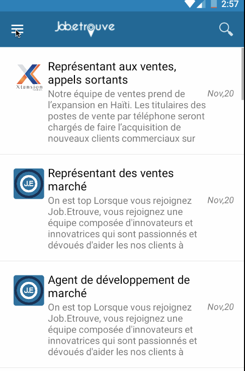

# emploiAPP
<h1>it's a private app<h1>
<h1>app for emploi</h1>
<ul>
  <li> . Allow user to connect with facebook or google account</li>
  <li> . Allow create his CV</li>
  <li> . Allow user to show a job</li>
  <li> . Allow user to add money on his account</li>
  <li> . Allow user to aplly for a job</li>
</lu>
https://play.google.com/store/apps/details?id=jfsl.jobetrouve&hl=fr

